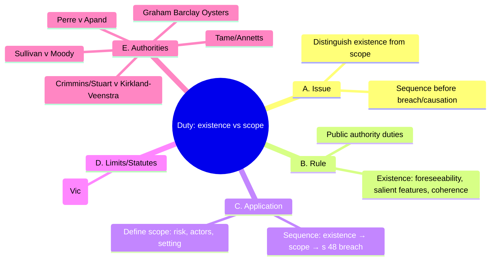

# 0002-duty-existence-vs-scope-updated.yml — Auto-curated structure

## Tripwires (exactly four)

1. Importing Shirt calculus into existence analysis.
2. Collapsing scope into s 51 causation.
3. Missing coherence checks for public authorities.
4. Overlooking psychiatric-harm/omission gates.

### Rationale
- Shirt calculus is irrelevant to duty existence; focus on foreseeability.
- Scope must be distinct from causation under s 51; do not conflate.
- Coherence checks are essential for public authorities; do not skip.
- Psychiatric harm and omissions require specific analysis; do not overlook.

## Diagram (Mermaid • 5 branches • exactly 12 children • ≤18 total nodes)

### Meta (recomputed from diagram text)

{
  "top_level_branches_text": 5,
  "child_vector_text": [
    2,
    2,
    2,
    1,
    5
  ],
  "children_sum_text": 12,
  "total_nodes_text": 18
}

### Coverage notes

{
  "kept_keywords": [
    "s 48 Wrongs Act 1958 (Vic)",
    "Sullivan v Moody",
    "Perre v Apand",
    "Graham Barclay Oysters",
    "Crimmins/Stuart v Kirkland-Veenstra",
    "Tame/Annetts"
  ],
  "omitted_low_yield": [
    "Specific examples of salient features; too detailed for general application."
  ],
  "risks": [
    "Potential loss of clarity on statutory provisions and case law due to compression."
  ]
}
