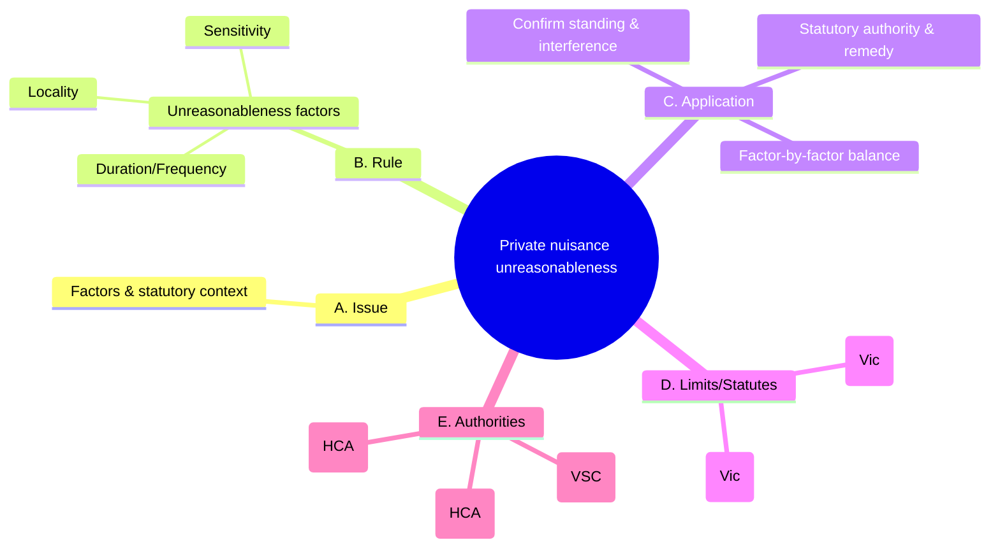

# 0006-private-nuisance-unreasonableness-factors.yml — Auto-curated structure

## Tripwires (exactly four)

1. Conflating private nuisance with trespass.
2. Assuming public utility is a defence.
3. Treating extraordinary sensitivity as actionable.
4. Seeking blanket injunctions without proportional tailoring.

### Rationale
- Common error in distinguishing between torts.
- Misunderstanding the role of utility in assessments.
- Failing to recognize the standard for sensitivity.
- Neglecting the need for tailored remedies.

## Diagram (Mermaid • 5 branches • exactly 12 children • ≤18 total nodes)

### Meta (recomputed from diagram text)

{
  "top_level_branches_text": 5,
  "child_vector_text": [
    1,
    4,
    3,
    2,
    3
  ],
  "children_sum_text": 13,
  "total_nodes_text": 19
}

### Coverage notes

{
  "kept_keywords": [
    "s 25 Environment Protection Act 2017 (Vic)",
    "Planning and Environment Act 1987 (Vic)",
    "Hargrave v Goldman (HCA)",
    "Burnie Port Authority v General Jones (HCA)",
    "Munro v Southern Dairies (VSC)"
  ],
  "omitted_low_yield": [
    "Gravity/type of harm and malice; they are less critical for the core understanding of unreasonableness."
  ],
  "risks": [
    "Potential loss of nuance in statutory context and authority integration."
  ]
}
