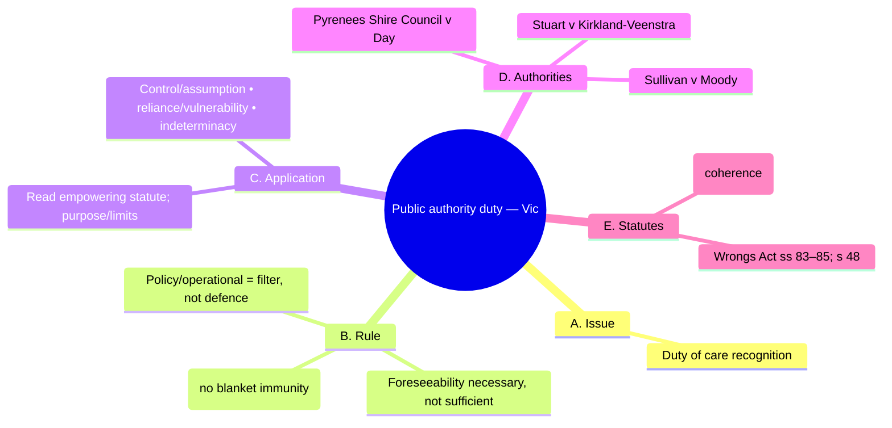

# 0010-public-authority-duty.yml — Auto-curated structure

## Tripwires (exactly four)

1. Policy/operational distinction is not an immunity.
2. No general rescue duty exists for public authorities.
3. Statutory purpose/resource limits must be considered.
4. Charter coherence is essential before duty extension.

### Rationale
- Commonly misinterpreted as blanket immunity.
- Students often assume a duty exists to prevent harm.
- Failure to consider limits leads to flawed duty arguments.
- Ignoring Charter coherence can result in incorrect duty recognition.

## Diagram (Mermaid • 5 branches • exactly 12 children • ≤18 total nodes)

### Meta (recomputed from diagram text)

{
  "top_level_branches_text": 5,
  "child_vector_text": [
    1,
    3,
    2,
    3,
    2
  ],
  "children_sum_text": 11,
  "total_nodes_text": 17
}

### Coverage notes

{
  "kept_keywords": [
    "s 48 Wrongs Act 1958 (Vic)",
    "ss 83\u201385 Wrongs Act (Vic)",
    "ss 7, 21, 38 Charter of Human Rights and Responsibilities Act 2006 (Vic)",
    "Sullivan v Moody",
    "Pyrenees Shire Council v Day",
    "Stuart v Kirkland-Veenstra",
    "Hunter v McKenna"
  ],
  "omitted_low_yield": [
    "Specific examples of cases (to focus on key principles)",
    "Detailed application steps (to streamline the card)"
  ],
  "risks": [
    "Potential oversimplification of complex statutory frameworks.",
    "Loss of nuanced understanding of case law applications."
  ]
}
