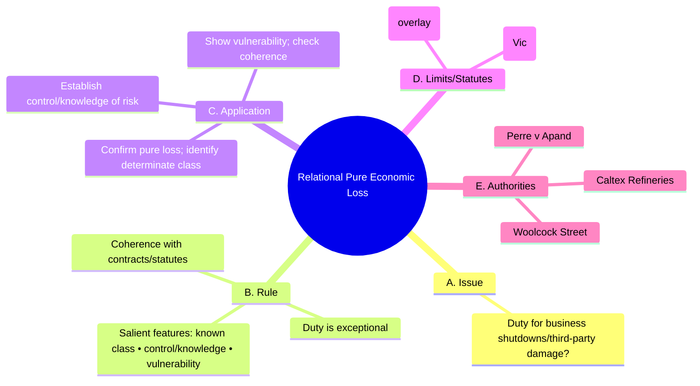

# 0012-pure-economic-loss-relational.yml — Auto-curated structure

## Tripwires (exactly four)

1. Assuming pure economic loss duties arise on foreseeability alone.
2. Collapsing vulnerability into mere financial exposure without self-protection analysis.
3. Ignoring contractual/statutory coherence when weighing salient features.
4. Treating proportionate liability or ACL overlays as duty substitutes instead of separate regimes.

### Rationale
- Foreseeability alone does not establish a duty; salient features must be assessed.
- Vulnerability requires a deeper analysis beyond financial exposure; self-protection is key.
- Coherence with contracts/statutes is essential for duty recognition; neglecting this is a common error.
- Proportionate liability and ACL overlays serve different purposes; conflating them leads to misapplication.

## Diagram (Mermaid • 5 branches • exactly 12 children • ≤18 total nodes)

### Meta (recomputed from diagram text)

{
  "top_level_branches_text": 5,
  "child_vector_text": [
    1,
    3,
    3,
    2,
    3
  ],
  "children_sum_text": 12,
  "total_nodes_text": 18
}

### Coverage notes

{
  "kept_keywords": [
    "s 48 Wrongs Act 1958 (Vic)",
    "ACL s 18, s 236",
    "Perre v Apand",
    "Caltex Refineries",
    "Woolcock Street"
  ],
  "omitted_low_yield": [
    "Examples of vulnerability and coherence; too specific for general application."
  ],
  "risks": [
    "Potential oversimplification of salient features test; may miss nuanced application."
  ]
}
