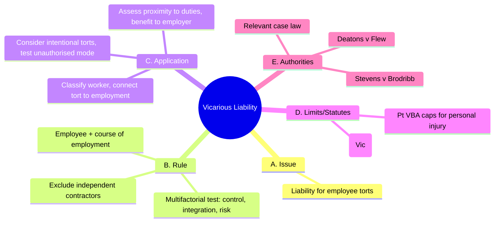

# 0017-vicarious-liability-master.yml — Auto-curated structure

## Tripwires (exactly four)

1. Assuming all employee torts are in course of employment.
2. Misclassifying workers based on a single factor.
3. Neglecting the Deatons test for battery cases.
4. Confusing vicarious liability with non-delegable duties.

### Rationale
- Common error; students often overlook the need for a thorough analysis of the employment context.
- Students may focus on one factor, leading to incorrect classifications.
- Deatons is crucial for intentional torts; ignoring it can lead to flawed conclusions.
- Vicarious liability and non-delegable duties are distinct; conflating them can mislead the analysis.

## Diagram (Mermaid • 5 branches • exactly 12 children • ≤18 total nodes)

### Meta (recomputed from diagram text)

{
  "top_level_branches_text": 5,
  "child_vector_text": [
    1,
    3,
    3,
    2,
    3
  ],
  "children_sum_text": 12,
  "total_nodes_text": 18
}

### Coverage notes

{
  "kept_keywords": [
    "s 48 Wrongs Act 1958 (Vic)",
    "Stevens v Brodribb",
    "Deatons v Flew"
  ],
  "omitted_low_yield": [
    "Examples of torts; not essential for doctrinal coverage."
  ],
  "risks": [
    "Potential oversimplification of the multifactorial test; missing nuances in worker classification."
  ]
}
