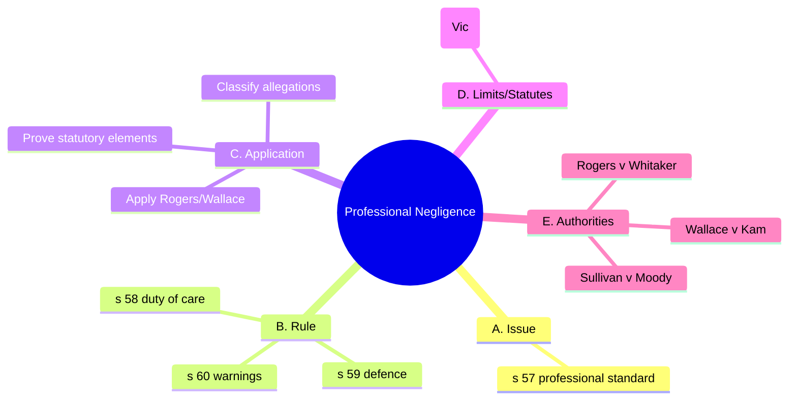

# 0019-professional-negligence-peer-opinion.yml — Auto-curated structure

## Tripwires (exactly four)

1. Applying s 59 to warnings (barred by s 60)
2. Assuming expert evidence suffices without proving national acceptance
3. Conflating consequential with pure economic loss
4. Ignoring s 59(3) allows multiple opinions

### Rationale
- Common error in misapplying statutory provisions regarding warnings.
- Mistake in treating expert evidence as definitive without necessary proof.
- Frequent confusion between types of economic loss leading to incorrect analysis.
- Overlooked allowance for competing opinions under s 59(3).

## Diagram (Mermaid • 5 branches • exactly 12 children • ≤18 total nodes)

### Meta (recomputed from diagram text)

{
  "top_level_branches_text": 5,
  "child_vector_text": [
    1,
    3,
    3,
    1,
    3
  ],
  "children_sum_text": 11,
  "total_nodes_text": 17
}

### Coverage notes

{
  "kept_keywords": [
    "s 57 Wrongs Act 1958 (Vic)",
    "s 58 duty of care",
    "s 59 defence",
    "s 60 warnings",
    "Rogers v Whitaker",
    "Wallace v Kam",
    "Sullivan v Moody"
  ],
  "omitted_low_yield": [
    "Detailed examples of allegations; not essential for doctrinal understanding."
  ],
  "risks": [
    "Potential loss of nuance in application of statutory provisions and case law."
  ]
}
